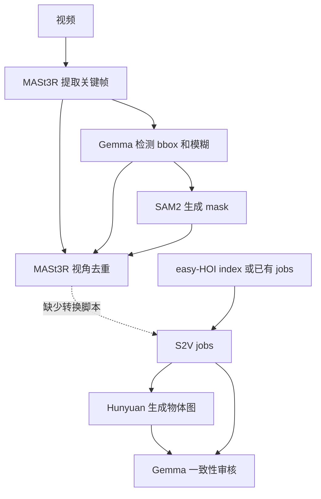

# Multi-Reference Data Preparation

从视频准备同一物体的多视角参考数据。本仓库仅维护流程文档，实现位于以下仓库。

## 仓库与依赖

| 项目 | GitHub | 流程分支 | 主要职责 |
|---|---|---|---|
| MASt3R | [Taited/MASt3R](https://github.com/Taited/MASt3R) | `wentai/keyframe-pipeline`（`main` 同步） | 提取关键帧、基于共视性的视角去重与可视化 |
| Gemma | [Taited/gemma](https://github.com/Taited/gemma) | `wentai/keyframe-pipeline` | 物体检测、模糊判断、bbox 和生成结果一致性审核 |
| SAM2 | [Taited/sam2](https://github.com/Taited/sam2) | `wentai/keyframe-pipeline` | 用 bbox 生成前景 mask |
| HunyuanImage-3.0 | [Taited/HunyuanImage-3.0](https://github.com/Taited/HunyuanImage-3.0) | `main` | 构建多视角 jobs，生成白底物体参考图 |



**第④→⑤步尚未打通**：`filtered.json` 不能直接传给 Hunyuan。⑤⑥使用已有 S2V jobs；从 easy-HOI index 构建 jobs 可参考 [Hunyuan 多视角说明](https://github.com/Taited/HunyuanImage-3.0/blob/main/README_S2V_MULTIVIEW.md)。

## 准备

将本仓库与 `mast3r/`、`gemma/`、`sam2/`、`HunyuanImage-3.0/` 放在同一工作区，各项目的 `dataset` 软链接指向共享的 `../dataset`。MASt3R 克隆到小写目录，并执行 `git submodule update --init --recursive`。

在本文档仓库根目录设置变量，后续命令在同一个 shell 中执行：

```bash
export WORKSPACE_ROOT="$(cd .. && pwd)"
export GEMMA_MODEL_DIR="$WORKSPACE_ROOT/weights/gemma-4-31B-it"
```

- 各仓库独立安装环境：MASt3R / Hunyuan 使用 `.venv`，Gemma 使用 `.venv-hf`，SAM2 使用 `.venv/sam2`。
- 数据、权重和虚拟环境不随 Git 提供。`GEMMA_MODEL_DIR` 可改为实际模型目录；旧 jobs 中的绝对图像路径也需迁移。
- 视频放在 `dataset/datatang_session2_videos_fps24_012/`，按 `<video_base>___<object_slug>.mp4` 命名。
- 预先准备 `dataset/gemma_result.json`：以视频相对路径为 key，值包含 `objects: [{"name": "物体名"}]`；空 objects 会被跳过。

| 模型 | 路径（相对工作区） |
|---|---|
| Gemma-4-31B-it | `$GEMMA_MODEL_DIR` |
| SAM2.1 hiera-large | `sam2/checkpoints/sam2.1_hiera_large.pt` |
| MASt3R metric | `mast3r/checkpoints/MASt3R_ViTLarge_BaseDecoder_512_catmlpdpt_metric.pth` |
| HunyuanImage-3.0-Instruct-Distil | `weights/HunyuanImage-3.0-Instruct-Distil` |

## ① 提取关键帧

按相邻帧灰度差异保留约 10%，输出关键帧目录与 `manifest.json`。帧号是从 0 开始的解码序号。

```bash
cd "$WORKSPACE_ROOT/mast3r"
.venv/bin/python extract_keyframes.py \
    --src dataset/datatang_session2_videos_fps24_012 \
    --out dataset/datatang_session2_videos_fps24_012_keyframes \
    --keep-ratio 0.10 --jobs 16
```

## ② 检测物体与 bbox

输入关键帧和 `gemma_result.json`，输出 `gemma_keyframe_bbox.json`，包含 bbox 与 `motion_blur`。更换数据集时需修改脚本中的 `GEMMA_JSON` / `KEYFRAMES_DIR`。

```bash
cd "$WORKSPACE_ROOT/gemma"
source .venv-hf/bin/activate      # transformers 环境，不是 .venv
torchrun --nproc_per_node 8 scripts/gemma31b_keyframe_bbox.py \
    --model "$GEMMA_MODEL_DIR" \
    --output-json dataset/gemma_keyframe_bbox.json \
    --max-new-tokens 256 --save-every 50
```

## ③ 生成前景 mask

输出 `dataset/gemma_keyframe_masks/<keyframe_dir>/frame_%06d.png`。脚本名中的 qwen3vl 是历史命名，可直接读取 Gemma 结果。

```bash
cd "$WORKSPACE_ROOT/sam2"
source env.sh          # 或直接用 .venv/sam2/bin/python
python tools/qwen3vl_bbox_to_mask.py \
    --bbox-json dataset/gemma_keyframe_bbox.json \
    --out-dir dataset/gemma_keyframe_masks \
    --checkpoint checkpoints/sam2.1_hiera_large.pt \
    --model-cfg configs/sam2.1/sam2.1_hiera_l.yaml
```

## ④ 去除模糊、小目标与重复视角

输入 bbox、关键帧和 mask，按目标面积优先保留不同视角。三者的子目录名和帧号必须对应。

```bash
cd "$WORKSPACE_ROOT/mast3r"
.venv/bin/python filter_frames_gemma.py --copy-frames --resume
.venv/bin/python viz_filtered.py --show-dropped
```

输出 `dataset/gemma_keyframe_filtered/filtered.json`、保留帧和可视化。先加 `--limit 1` 可做小样本检查；调大 `--tau-dup` 会保留更多视角。大规模运行可使用 `--nshards/--shard`，输出为各分片 JSON，需自行合并。

## ⑤ 生成多视角物体图

使用已有 anchor / extra-view jobs，保留 `sample_id + entity_id` 分组。jobs 还需包含 `job_name`、`frame_path`、`frame_index`、`object_name` 和归一化 `bbox_norm`。

先给以下两条推理命令加 `--limit 8 --dry-run` 检查输入，再去掉这两个参数正式生成：

```bash
cd "$WORKSPACE_ROOT/HunyuanImage-3.0"

CUDA_VISIBLE_DEVICES=0,1 .venv/bin/python run_s2v_multiview_hunyuan_distil.py \
  --jobs dataset/s2v_keyframe_recontext/jobs.latest_all.jsonl \
  --output-root dataset/s2v_object_only-hunyuan-distil/full_bbox_direct_v2 \
  --prompt-profile strict_v2 --input-mode bbox

CUDA_VISIBLE_DEVICES=0,1 .venv/bin/python run_s2v_multiview_hunyuan_distil.py \
  --jobs dataset/s2v_keyframe_recontext/jobs.latest_all.extra_views.jsonl \
  --output-root dataset/s2v_object_only-hunyuan-distil/extra_views_latest_all \
  --prompt-profile strict_v2 --input-mode bbox
```

每个输出目录包含 `videos/<sample_id>/edited/`、`reference_inputs/`、`compare/` 和 `manifest.shard_XX.jsonl`。Distil 固定 **8 steps**，建议每个 worker 使用两张 GPU；白底检查不能替代语义审核。

## ⑥ 审核生成结果

检查物体身份、指令符合度、几何合理性及跨视角一致性。先关联 jobs 与生成 manifests：

```bash
cd "$WORKSPACE_ROOT/gemma"
source .venv-hf/bin/activate

python scripts/gemma31b_edited_frame_consistency.py \
  --prepare-only \
  --main-jobs dataset/s2v_keyframe_recontext/jobs.latest_all.jsonl \
  --extra-jobs dataset/s2v_keyframe_recontext/jobs.latest_all.extra_views.jsonl \
  --main-root dataset/s2v_object_only-hunyuan-distil/full_bbox_direct_v2 \
  --extra-root dataset/s2v_object_only-hunyuan-distil/extra_views_latest_all \
  --worklist dataset/gemma_edited_frame_consistency.jobs.jsonl
```

确认 `matched_outputs` 与已完成生成数量一致后运行：

```bash
torchrun --standalone --nproc_per_node=8 \
  scripts/gemma31b_edited_frame_consistency.py \
  --model "$GEMMA_MODEL_DIR" \
  --reuse-worklist \
  --worklist dataset/gemma_edited_frame_consistency.jobs.jsonl \
  --output-jsonl dataset/gemma_edited_frame_consistency.jsonl \
  --batch-size 1 --max-peers 3
```

结果写入 `dataset/gemma_edited_frame_consistency.jsonl`。`status == "ok"` 且 `verdict.pass == true` 才通过；质量失败需根据 `defects/reason` 重新生成，脚本不会自动调用 Hunyuan。

## 续跑与排查

- Gemma bbox：保留 `.rankN.tmp`，原命令重跑；一致性审核会跳过 `status == "ok"`，重试推理失败项。
- SAM2 / Hunyuan：默认跳过已有结果；MASt3R 使用 `--resume` 按目录续跑。
- 检测结果为空：检查视频的 `___<object_slug>` 后缀与 `gemma_result.json`。
- 图片或 mask 找不到：检查工作目录、`dataset` 软链接及帧名是否一致。
- 其他参数见脚本 `--help`；按时间顺序选视角的替代方案是 `mast3r/select_new_views.py`，它不处理模糊标记。
