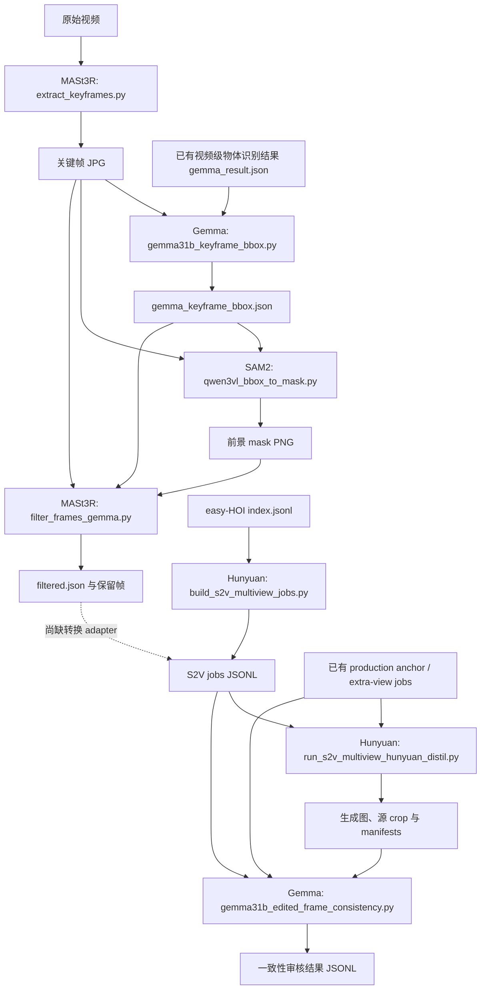

# Multi-Reference Data Preparation

从视频准备同一物体的多视角参考数据：关键帧提取、物体检测、前景分割、视角去重、参考图生成和一致性审核。

完整运行说明：[KEYFRAME_PIPELINE.md](KEYFRAME_PIPELINE.md)。本目录是流程文档入口；实现代码位于下列四个独立仓库。

## 代码仓库

| 项目 | GitHub | 流程分支 | 已核对提交 | 主要职责 |
|---|---|---|---|---|
| MASt3R | [Taited/MASt3R](https://github.com/Taited/MASt3R) | `wentai/keyframe-pipeline`（`main` 同步） | `6205e75` | 提取关键帧、基于共视性的视角去重与可视化 |
| Gemma | [Taited/gemma](https://github.com/Taited/gemma) | `wentai/keyframe-pipeline` | `3082bfb` | 物体检测、模糊判断、bbox 和生成结果一致性审核 |
| SAM2 | [Taited/sam2](https://github.com/Taited/sam2) | `wentai/keyframe-pipeline` | `6534db3` | 用 bbox 生成前景 mask |
| HunyuanImage-3.0 | [Taited/HunyuanImage-3.0](https://github.com/Taited/HunyuanImage-3.0) | `main` | `9266ed4` | 构建多视角 jobs，生成白底物体参考图 |

提交号是本次核查的版本快照，不代表远端以后不会更新。

## 项目间的数据依赖



- **Gemma 检测依赖 MASt3R 提取的关键帧**，同时需要预先准备的视频级 `gemma_result.json`。
- **SAM2 依赖 Gemma 的 bbox 和对应关键帧**，输出前景 mask。
- **MASt3R 去重依赖关键帧、Gemma bbox 和 SAM2 mask**，输出保留视角列表。
- **Hunyuan 依赖 S2V jobs 和 jobs 引用的图像**。现有 builder 从 easy-HOI index 构建 jobs；它不能直接读取 MASt3R 的 `filtered.json`。
- **Gemma 审核依赖 Hunyuan 生成图、源参考 crop、manifests 和对应 source jobs**，按 `sample_id + entity_id` 分组比较视角一致性。

这些是文件数据依赖，不要求四个项目安装在同一个 Python 环境中。Gemma 在检测和审核两个阶段被复用，不是软件包循环依赖。

## 目录与运行位置

```text
wentai/
├── multi-reference-data-preparation/
│   ├── README.md
│   └── KEYFRAME_PIPELINE.md
├── mast3r/
├── gemma/
├── sam2/
├── HunyuanImage-3.0/
├── dataset/
└── weights/
```

四个实现项目的 `dataset` 软链接均指向 `wentai/dataset`。数据、权重和虚拟环境需单独准备，不随 Git 仓库提供。

`wentai/` 只是现有工作区名称，可替换为任意目录。按流程文档开头在本仓库根目录设置 `WORKSPACE_ROOT` 与 `GEMMA_MODEL_DIR`；后续命令显式定位到对应代码仓库。各项目使用自己的 Python 环境，具体路径见流程文档。

## MASt3R 内部依赖

- `filter_frames_gemma.py` 复用 `select_new_views.py` 的 mask 读取与共视性计算函数。
- `viz_filtered.py` 复用 `viz_newviews.py` 的可视化辅助函数。
- MASt3R 通过 Git 子模块依赖 [naver/dust3r](https://github.com/naver/dust3r)，后者还包含 CroCo 子模块。新克隆后应在 `mast3r/` 执行 `git submodule update --init --recursive`。
- Hunyuan 的 runner 依赖已提交的 `s2v_object_only_runtime.py`，jobs builder 依赖已提交的 `s2v_anchor_selection.py`。

## 当前流程边界

1. `filtered.json` 到 S2V jobs 的 adapter 尚未实现，图中的虚线表示缺失接口，不能视为已经打通。
2. 审核失败后的 job 提取、seed/prompt 调整与重新入队仍需调度层完成；Gemma 审核脚本不会自动调用 Hunyuan 重生成。
3. 本目录保存流程文档与仓库关系，不包含数据、权重或密钥。
